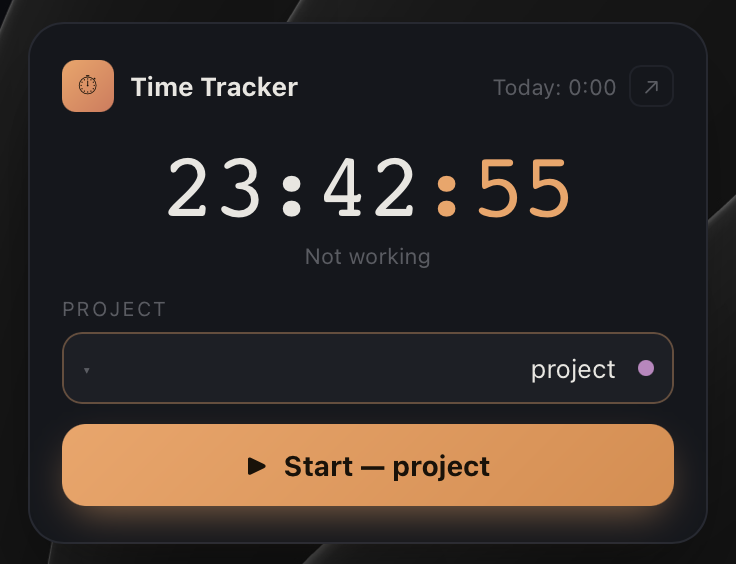
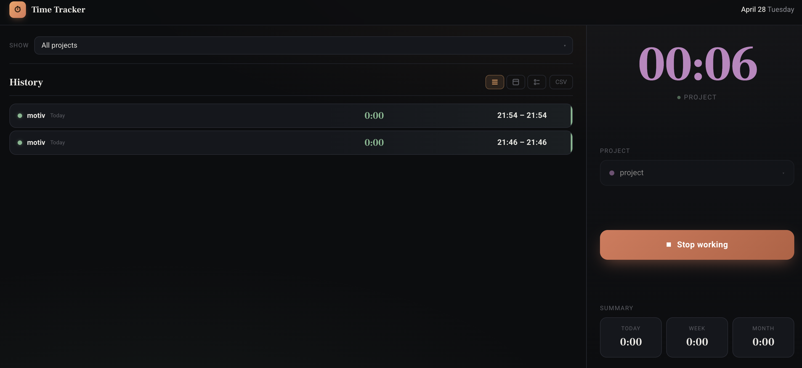

# Time Tracker Widget

 

Time tracking tool by project, with an Übersicht desktop widget and a full web app.

## Architecture

```
time-tracker/
  server.js          ← API server (Node.js, port 57321)
  state.json         ← database (JSON flat file)
  index.html         ← full web app
  time-tracker.jsx   ← Übersicht widget
```

`state.json` is the single source of truth — both the widget and the web app read/write through the API.

## Installation

```bash
git clone https://github.com/edensitko/time-tracker
cd time-tracker
chmod +x install.sh && ./install.sh
```

That's it. The script will:
- Start the server and set it to auto-start on login
- Install the widget into Übersicht
- Create an empty `state.json`

---

## Manual Setup

### 1. Create state.json

Create an empty `state.json` file in the project root:

```bash
echo '{"projects":[],"sessions":[],"activeSession":null,"selectedProjectId":null}' > state.json
```

### 2. Start the server

```bash
cd ~/Desktop/time-tracker
node server.js
```

Runs on `http://127.0.0.1:57321`

### 2. Auto-start server on login (LaunchAgent)

So the server starts automatically every time macOS boots:

```bash
# Edit the plist and replace the node path with yours:
which node   # copy the output

# Then install:
cp com.timetracker.server.plist ~/Library/LaunchAgents/
launchctl load ~/Library/LaunchAgents/com.timetracker.server.plist
```

To stop/uninstall:
```bash
launchctl unload ~/Library/LaunchAgents/com.timetracker.server.plist
```

Logs are written to `server.log` in the project folder.

### 3. Übersicht widget

1. Install [Übersicht](https://tracesof.net/uebersicht/)
2. Copy the widget file:
```bash
cp time-tracker.jsx ~/Library/Application\ Support/Übersicht/widgets/
```
3. The widget will appear on your desktop automatically.

> **Important:** The server must be running before the widget loads, otherwise it shows "Server offline".

The widget refreshes every second and shows a live clock / active timer + Punch In/Out button.

### 3. Web app

```
http://127.0.0.1:57321
```

Or click the ↗ button in the widget.

## Usage

### Tracking time

1. **Select a project** from the dropdown
2. Click **Start** — timer begins
3. Click **Stop** — session is saved

### Managing projects

- Add: type a name at the bottom of the dropdown → **+ Add**
- Delete: hover over a project → click ×
- Colors are assigned automatically from the palette

### History

3 views:
- **List** — all sessions sorted by date descending
- **By day** — grouped with daily totals
- **By project** — grouped with per-project totals

Filter by a specific project using the "Show" dropdown.

### Editing a session

Click any session in history → edit date, times, project → **Save**.

### Export

Click **CSV** → downloads a file with all sessions (Excel compatible).

## API

| Method | URL | Description |
|--------|-----|-------------|
| GET | `/state` | Read current state |
| POST | `/state` | Write new state |
| GET | `/` | Serve index.html |

### state.json structure

```json
{
  "projects": [
    { "id": "p_...", "name": "Project Name", "color": "#f4a261", "createdAt": 1234567890 }
  ],
  "sessions": [
    { "id": "sess_...", "projectId": "p_...", "start": 1234567890, "end": 1234567890 }
  ],
  "activeSession": { "projectId": "p_...", "start": 1234567890 },
  "selectedProjectId": "p_..."
}
```

## Tips

- **Restart Übersicht** if the widget is unresponsive: `pkill -f Uebersicht && open -a Übersicht`
- **Server must be running** before opening the widget or web app
- **state.json** is plain JSON — easy to back up or inspect manually
